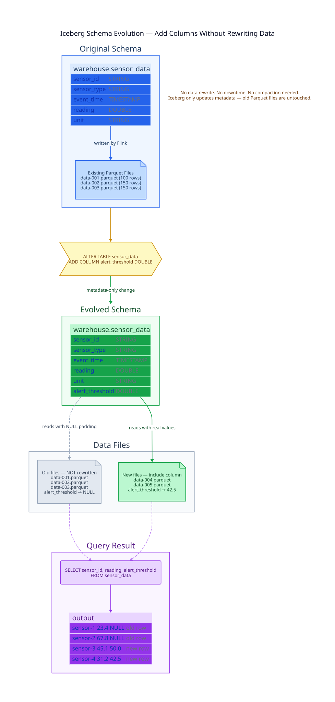

= Flink-Trino-Superset Data Pipeline
:toc:
:icons: font
:source-highlighter: highlight.js

image:https://github.com/gAmUssA/flink-trino-superset-pipeline/actions/workflows/ci.yml/badge.svg[CI,link=https://github.com/gAmUssA/flink-trino-superset-pipeline/actions/workflows/ci.yml]
image:https://img.shields.io/badge/Apache%20Kafka-231F20?logo=apache-kafka&logoColor=white[Apache Kafka]
image:https://img.shields.io/badge/Apache%20Flink-E6526F?logo=apache-flink&logoColor=white[Apache Flink]
image:https://img.shields.io/badge/Apache%20Iceberg-2980B9?logo=apache&logoColor=white[Apache Iceberg]
image:https://img.shields.io/badge/Trino-DD00A1?logo=trino&logoColor=white[Trino]
image:https://img.shields.io/badge/Apache%20Superset-00D1B2?logo=apache&logoColor=white[Apache Superset]
image:https://img.shields.io/badge/Java-17-007396?logo=java&logoColor=white[Java 17]
image:https://img.shields.io/badge/Gradle-02303A?logo=gradle&logoColor=white[Gradle]
image:https://img.shields.io/badge/Docker-2496ED?logo=docker&logoColor=white[Docker]

An end-to-end streaming data pipeline: Kafka ingests events, Flink processes them in real-time into Iceberg tables, Trino provides SQL analytics, and Superset visualizes the results.

== Architecture

The pipeline processes two data streams in parallel:

* **User Activity** – page views, clicks, searches, and purchases generated by simulated users
* **Sensor Data** – temperature, humidity, pressure, light, and motion readings from IoT devices

=== Data Flow

[cols="1,3",options="header"]
|===
|Step |Description

|1. Generate
|Python data generator produces realistic events using the Faker library

|2. Ingest
|Apache Kafka (KRaft mode, no Zookeeper) receives JSON events on `user-activity` and `sensor-data` topics

|3. Process
|Apache Flink Table API consumes from Kafka, transforms data (flattens nested structs, renames fields, adds processing timestamps), and writes to Iceberg

|4. Store
|Apache Iceberg tables (`warehouse.user_activity`, `warehouse.sensor_data`) stored as Parquet files in SeaweedFS (S3-compatible)

|5. Query
|Trino reads Iceberg tables via REST catalog, provides analytics views (`hourly_user_activity`, `sensor_stats`) and Iceberg feature views (`iceberg_commit_log`, `sensor_schema_evolution`)

|6. Visualize
|Apache Superset connects to Trino for interactive dashboards and charts
|===

=== Docker Services

== Quick Start

Run the full demo with a single command:

[source,bash]
----
make demo
----

This builds the Flink jobs, starts all 9 Docker services, deploys streaming jobs, creates analytics views, and initializes Superset. 
Takes ~5 minutes on the first run (Docker image pulls).

=== Manual Step-by-Step

[source,bash]
----
# 1. Build Flink job JARs
make build

# 2. Start all services
make up

# 3. Wait for Trino, then create analytics views
make wait-for-trino
make create-tables

# 4. Deploy Flink streaming jobs
make deploy-flink-jobs

# 5. Initialize Superset
make setup-superset

# 6. Verify everything works
make verify-demo
----

== Prerequisites

* Docker and Docker Compose (https://orbstack.dev/[OrbStack] recommended for macOS)
* Java 17+ (for building Flink jobs)
* https://sdkman.io/[SDKMAN!] for managing Java SDKs

== Accessing Services

[cols="1,2,2",options="header"]
|===
|Service |URL |Credentials

|Flink Dashboard
|http://localhost:8081
|--

|SeaweedFS UI
|http://localhost:9001
|S3: minioadmin / minioadmin

|Iceberg REST Catalog
|http://localhost:8181
|--

|Trino UI
|http://localhost:8082/ui/
|admin

|Trino CLI
|`docker exec -it trino-coordinator trino --server localhost:8080 --catalog iceberg`
|--

|Superset
|http://localhost:8088
|admin / admin
|===

== Data Generator Configuration

The data generator supports local and Confluent Cloud Kafka environments via the `KAFKA_ENV` variable in `docker-compose.yml`:

[source,yaml]
----
data-generator:
  environment:
    KAFKA_ENV: local   # 'local' for Docker Kafka, 'cloud' for Confluent Cloud
----

Configuration files in `config/local/` and `config/cloud/` define bootstrap servers, security, and topic names.

== Project Structure

[source]
----
.
├── config/                          # Kafka configuration
│   ├── cloud/                       # Confluent Cloud (SASL_SSL)
│   │   ├── kafka.properties
│   │   └── topics.properties
│   └── local/                       # Local Docker Kafka
│       ├── kafka.properties
│       └── topics.properties
├── data-generator/                  # Python event producer (Faker + confluent-kafka)
│   ├── Dockerfile
│   ├── data_generator.py
│   └── requirements.txt
├── docker-compose.yml               # All 9 services
├── docs/
│   ├── diagrams/                    # D2 architecture diagrams (source + SVG)
│   │   ├── architecture.d2
│   │   ├── architecture.svg
│   │   ├── data-flow.d2
│   │   ├── data-flow.svg
│   │   ├── docker-services.d2
│   │   ├── docker-services.svg
│   │   ├── time-travel.d2
│   │   ├── time-travel.svg
│   │   ├── schema-evolution.d2
│   │   └── schema-evolution.svg
│   └── iceberg-guide.adoc               # Iceberg integration reference
├── flink/
│   └── Dockerfile                   # Flink 1.20 + Iceberg 1.8.1 + Kafka connector
├── flink-jobs/
│   ├── build.gradle.kts             # Gradle build (3 fat JARs)
│   ├── create_tables.sql            # Trino analytics views
│   ├── sql-jobs/                    # Flink SQL streaming jobs
│   │   ├── sensor-data-to-iceberg.sql
│   │   └── user-activity-to-iceberg.sql
│   ├── src/main/java/com/example/  # Java Table API jobs
│   │   ├── UserActivityProcessor.java
│   │   ├── SensorDataProcessor.java
│   │   └── MessageCounterJob.java
│   └── src/test/java/com/example/  # Smoke tests
│       ├── UserActivityProcessorTest.java
│       └── SensorDataProcessorTest.java
├── scripts/
│   └── duckdb_query.py              # Query Iceberg tables locally via DuckDB
├── seaweedfs/
│   └── s3.json                      # S3 credentials config
├── superset/
│   ├── Dockerfile                   # Superset 4.1.1 + trino driver
│   └── init_superset.sh
├── trino/
│   └── etc/                         # Trino server + Iceberg catalog config
│       ├── catalog/
│       │   ├── iceberg.properties
│       │   └── memory.properties
│       ├── config.properties
│       ├── jvm.config
│       ├── log.properties
│       └── node.properties
├── .github/
│   ├── dependabot.yml               # Automated dependency updates
│   └── workflows/
│       └── ci.yml                   # Build, test, and infra smoke test
├── Makefile                         # Automation targets
├── project_learnings.adoc
├── requirements.adoc
└── VERIFY.adoc
----

== Key Technologies

[cols="1,1,2",options="header"]
|===
|Component |Version |Role

|Apache Kafka
|3.9.0 (KRaft)
|Event streaming (no Zookeeper dependency)

|Apache Flink
|1.20.0
|Stream processing via Table API and SQL

|Apache Iceberg
|1.8.1
|Open table format with REST catalog

|SeaweedFS
|latest
|S3-compatible object storage

|Trino
|latest
|Distributed SQL query engine

|Apache Superset
|4.1.1
|Data visualization and dashboarding
|===

== Makefile Targets

[source,bash]
----
make help               # Show all available targets
make demo               # Full automated setup (build + start + deploy + verify)
make up / make down     # Start / stop Docker services
make destroy            # Stop everything, delete volumes and build artifacts
make build              # Build Flink job JARs
make test               # Run Flink job smoke tests
make deploy-flink-jobs  # Deploy Flink streaming jobs
make deploy-sql-scripts # Copy SQL jobs to Flink SQL client
make create-tables      # Create Trino analytics views
make setup-superset     # Initialize Superset with dashboard
make time-travel        # Show Iceberg snapshots and time-travel queries
make schema-evolution   # Demo adding columns without rewriting data
make duckdb             # Query Iceberg tables locally via DuckDB (no Trino)
make diagrams           # Render D2 diagrams to SVG
make smoketest          # Verify all containers are running
make verify-demo        # Full end-to-end verification
make urls               # Show all service URLs and credentials
make logs               # Stream logs from all services
----

== Iceberg Features

Beyond the core streaming pipeline, this project demonstrates three key Iceberg capabilities that differentiate it from plain Parquet or Hive tables.

=== Time Travel

Iceberg tracks every commit as an immutable snapshot.
Since Flink commits to checkpoint boundaries (~30s), you get a built-in audit trail of your streaming pipeline.

[source,bash]
----
# Show snapshots and compare current vs 5-minute-ago record counts
make time-travel
----

Or run interactively in the Trino CLI:

[source,sql]
----
-- Sensor data as it looked 10 minutes ago
SELECT COUNT(*), AVG(reading) FROM iceberg.warehouse.sensor_data
  FOR TIMESTAMP AS OF (current_timestamp - interval '10' minute);

-- Browse all snapshots (each = one Flink checkpoint)
SELECT snapshot_id, committed_at, operation
  FROM iceberg.warehouse."sensor_data$snapshots"
  ORDER BY committed_at DESC;

-- Query a specific snapshot by ID
SELECT * FROM iceberg.warehouse.user_activity
  FOR VERSION AS OF 1234567890;
----

=== Schema Evolution

Iceberg supports adding columns without rewriting existing data -- old rows return `NULL` for new columns.

[source,bash]
----
# Add alert_threshold to sensor_data, device_type to user_activity
make schema-evolution
----

This runs `ALTER TABLE ... ADD COLUMN IF NOT EXISTS` via Trino, then shows `DESCRIBE` output proving the new columns exist alongside old data.
No compaction, no rewrite, no downtime.

=== DuckDB Local Queries

Demonstrates Iceberg's engine independence: Flink writes the data, Trino serves it for dashboards, and DuckDB can query the same tables locally with zero server infrastructure.

[source,bash]
----
uv pip install duckdb
make duckdb
----

The script (`scripts/duckdb_query.py`) connects directly to the Iceberg REST catalog and SeaweedFS, then runs aggregations over both `sensor_data` and `user_activity` -- same Parquet files, no Trino involved.

=== Superset Dashboard

The Superset dashboard includes an **Iceberg Features** section (below the original streaming analytics charts) with three visualizations:

[cols="1,2,2",options="header"]
|===
|Chart |Type |What it shows

|Iceberg Commit Log
|Table
|Every Flink checkpoint commit as an Iceberg snapshot -- timestamp, operation, records added, running total

|Data Growth Over Time
|Line chart
|Total record count growing over time, one data point per snapshot commit (~30s intervals)

|Schema Evolution
|Table
|Sensor readings including the `alert_threshold` column added via `ALTER TABLE` -- old rows show `NULL`, proving no data rewrite occurred
|===

These charts are backed by two Trino views created by `make create-tables`:

* `iceberg_commit_log` -- extracts `added-records` and `total-records` from the Iceberg `$snapshots` summary map
* `sensor_schema_evolution` -- projects sensor data including the evolved `alert_threshold` column

The dashboard export (`superset/dashboard_export.zip`) is imported automatically during `make setup-superset`.

== Editing Diagrams

Architecture diagrams are authored in https://d2lang.com/[D2] and stored in `docs/diagrams/`. To regenerate SVGs after editing:

[source,bash]
----
# Install d2: brew install d2
# Or just: make diagrams
d2 --sketch docs/diagrams/architecture.d2 docs/diagrams/architecture.svg
d2 --sketch docs/diagrams/data-flow.d2 docs/diagrams/data-flow.svg
d2 --sketch docs/diagrams/docker-services.d2 docs/diagrams/docker-services.svg
d2 --sketch docs/diagrams/time-travel.d2 docs/diagrams/time-travel.svg
d2 --sketch docs/diagrams/schema-evolution.d2 docs/diagrams/schema-evolution.svg
----

== Troubleshooting

* **Services not starting**: `docker-compose logs <service-name>`
* **No data in Iceberg tables**: Check Flink Dashboard at :8081 for running jobs; verify data generator is producing with `docker logs data-generator`
* **Trino queries failing**: Ensure Iceberg REST Catalog (:8181) and SeaweedFS (:9000) are healthy
* **Superset connection issues**: Verify Trino is running; connection URI should be `trino://admin@trino-coordinator:8080/iceberg/warehouse`

== CI & Dependency Management

* **GitHub Actions** — builds JARs, runs smoke tests, and validates infrastructure on every push/PR. 
See `.github/workflows/ci.yml`.
* **Dependabot** — automatically creates PRs for Gradle deps, Docker images, Python packages, and GitHub Actions. 
Runs weekly on Saturdays. 
See `.github/dependabot.yml`.

== License

MIT License – see the LICENSE file for details.
